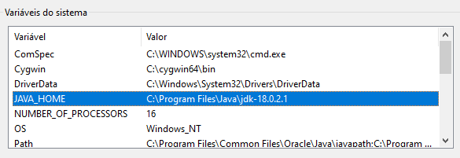

# Googol - Manual de Instalação
---
## Passo 1 - Java
### Certificar que Java e o JDK adequado estão instalados
 - Java e JDK [Download](https://www.oracle.com/pt/java/technologies/downloads/)

## Passo 2 - JAVA_HOME
- Criar a variável ``JAVA_HOME`` nas variáveis do sistema (variaveis de ambiente), sendo o valor o caminho para a pasta `bin` do JDK

## Passo 3 - Correr o programa
 - Basta correr os scripts `run_1.bat` e `runFront.bat` por esta mesma ordem; a compilação será executada e o programa inicia

---
# For devs
## Alterar ips
### Onde encontrar ip da maquina
- verificar o ip atual da maquina com o comando `ipconfig`
- o ip que aparece em frente a `IPv4` é o necessario
- esta no formato `xxx.xxx.xxx.xxx` (apenas isto é necessario)

### Onde fazer alteraçoes
- nos ficheiros de codigo fonte: *RMIGateway.java*, *Barrel.java*, *RMIClient.java* e *Downloader.java*
- em cada um deles, ir ou à fução `main` (Downloader e Barrel) ou à função `RMI[Name]` (Name: Gateway e Client)
- apenas é necessario alterar os ips
- depois de feito, basta seguir os passos acima do manual de instalação (se tudo instalado apenas passo 3)